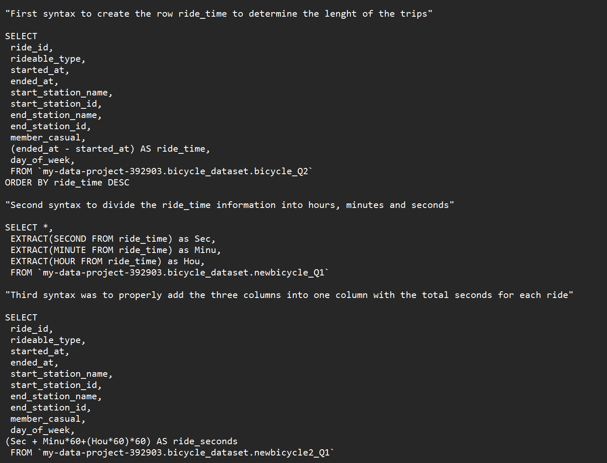

# BikeRides Capstone Project
Finding differences between casual users and members use the app

## Introduction

This is the final project for the Coursera Google analytics certificate. In this case Study, we will be working for a fictional company call cyclistic. We are trying to find out what marketing campaign would be effective in converting casual users into members. In this instance we need to find the differences of how casual users use the app versus members.  

## Main question to answer: How do annual members and casual riders use Cyclistic bikes differently?

We can analyze the habits of casual users vs members and identify the differences so that we know which casual users are more likely to change to an annual membership.

---

## Ciclystic data

The data is in CVS format, and it is data that was gathered via the same company. It is organized by Ride ID. It, tracks the started and ending time and date, the station names and id , and what type of members they are. Since the data has been gathered by the company, we can be sure that it is firsthand data that can be trusted. 

---

## Processing the data 

Excel workflow for initial cleaning

-	Made sure the data was formatted correctly 
-	Made sure to erase irrelevant data like the HQ data
-	Removed blanks 
-	Created the columns ride_lenght and day of week for a better analysis. 

SQL workflow for cleaning and summary tables 

- Additional filtering for incorrect/irrelevant data
- Format Ride_length to seconds for easier analysis

Process for filtering out all rides that were less
than 1 minute and casual rides that lasted more than 24 hours | Process for formating ride_length to seconds 
:------------------------------------------------------------:|:-----------------------------------------------:

 

