# BikeRides Capstone Project
Finding differences between casual users and members use the app

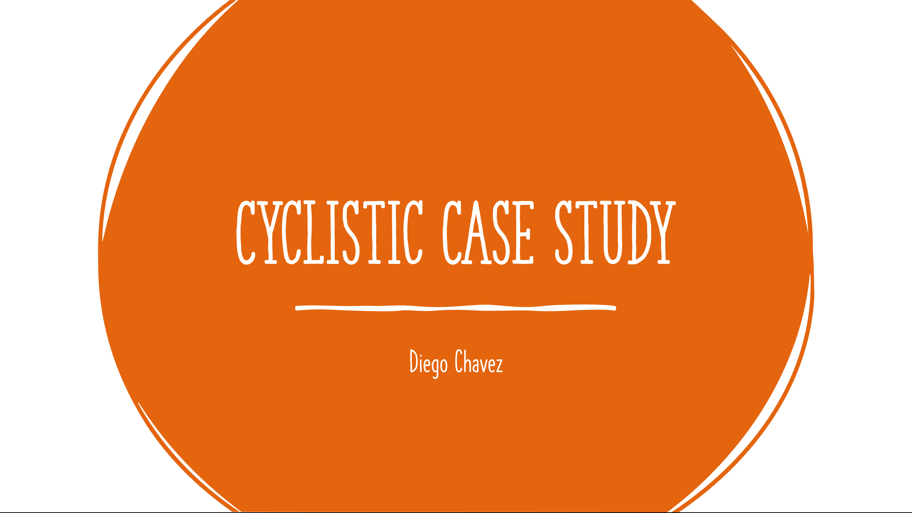

## Introduction

This is the final project for the Coursera Google analytics certificate. In this case Study, we will be working for a fictional company call cyclistic. We are trying to find out what marketing campaign would be effective in converting casual users into members. In this instance we need to find the differences of how casual users use the app versus members.  

## Main question to answer: How do annual members and casual riders use Cyclistic bikes differently?

We can analyze the habits of casual users vs members and identify the differences so that we know which casual users are more likely to change to an annual membership.

---

## Ciclystic data

The data is in CVS format, and it is data that was gathered via the same company. It is organized by Ride ID. It, tracks the started and ending time and date, the station names and id , and what type of members they are. Since the data has been gathered by the company, we can be sure that it is firsthand data that can be trusted. 

---

## Processing the data 

Excel workflow for initial cleaning

-	Made sure the data was formatted correctly 
-	Made sure to erase irrelevant data like the HQ data
-	Removed blanks 
-	Created the columns ride_lenght and day of week for a better analysis. 

SQL workflow for cleaning and summary tables 

- Additional filtering for incorrect/irrelevant data
- Format Ride_length to seconds for easier analysis

Process for filtering out all rides that were less than 1 minute and casual rides that lasted more than 24 hours | Process for formating ride_length to seconds 
:---------------------------------------------------------------------------------:|:---------------------------------------------------------------------:
      | 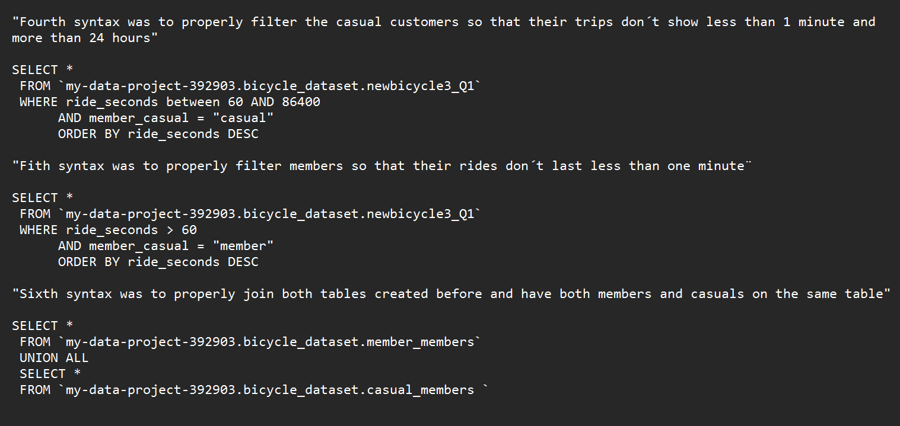 

 ---

 ## Analysis 

In order to analyze the data it will be necessary to process it in SQL due to the large amount of data. We will be finding the average ride lengths for members and casuals. Also, the average ride length for users based on the day of the week. Furthermore, we will need to determine the amount of rides on each day. Lastly, we will see which stations are the most popular for the users.

Calculating average ride length for both types of users     |  Calculating average ride length based on the day of the week 
:----------------------------------------------------------:|:---------------------------------------------------------------------:
 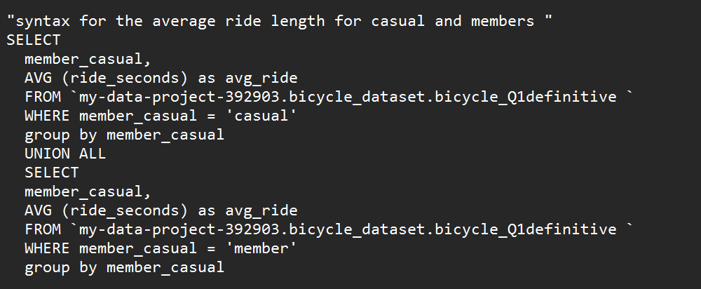     | 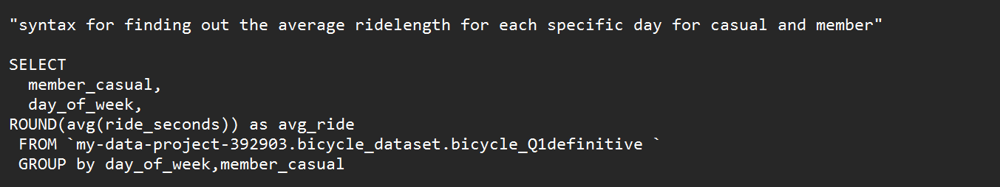 
 Calculating number of rides per day    |  Calculating the most popular stations 
 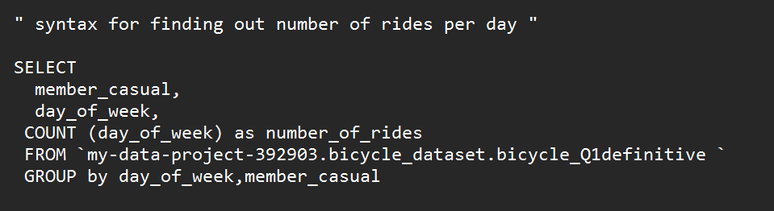     | 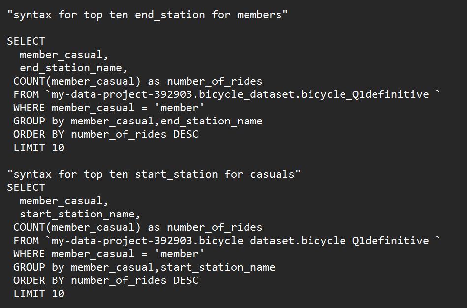 

 ---

 ## Visualizations

In this case, we were able to find significant differences between both user types. 

 1. On average the casual user has longer rides than the members

 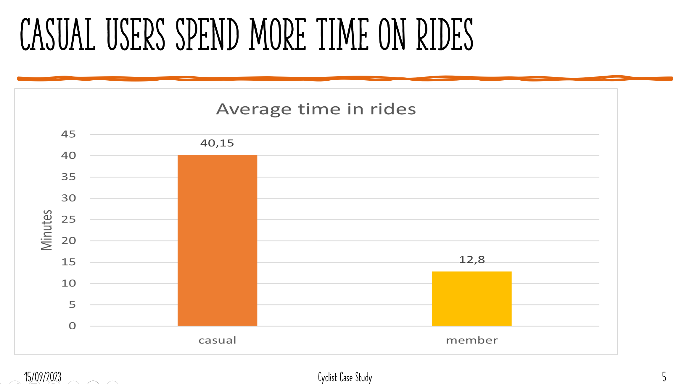

 2. members have more rides completed

 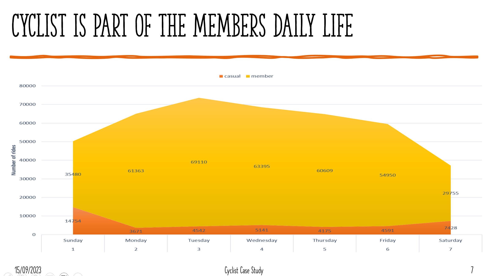

 3. Ride time goes up on the weekends

 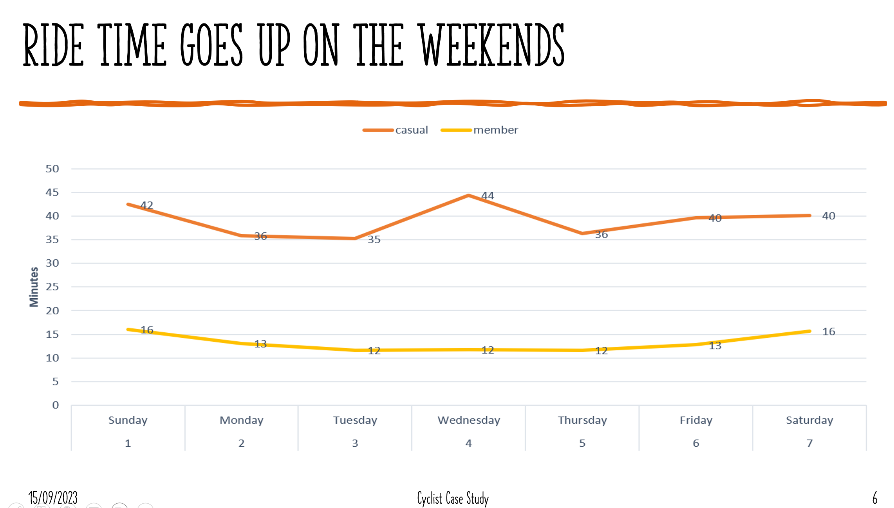

 4. There is no overlapse on locations 

  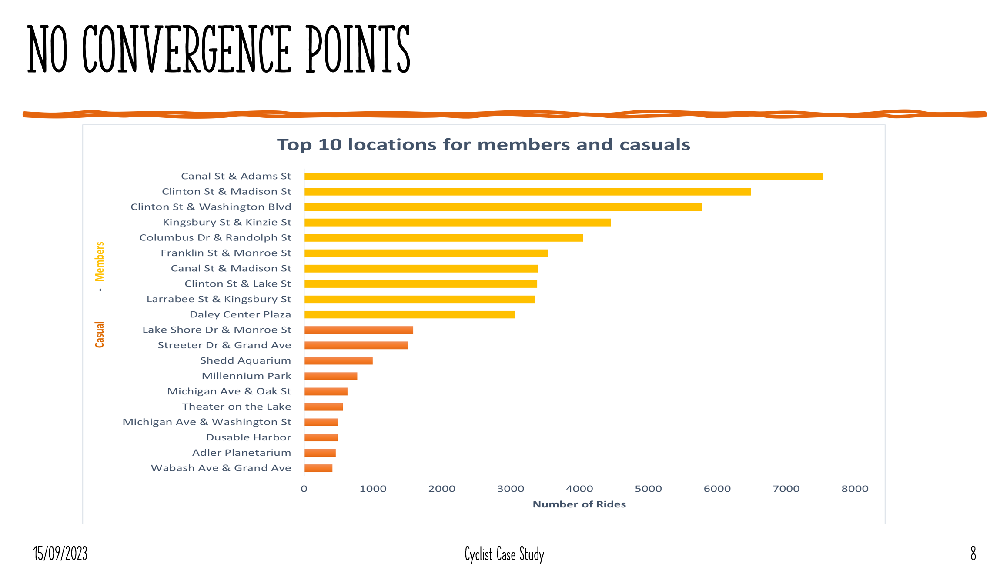

  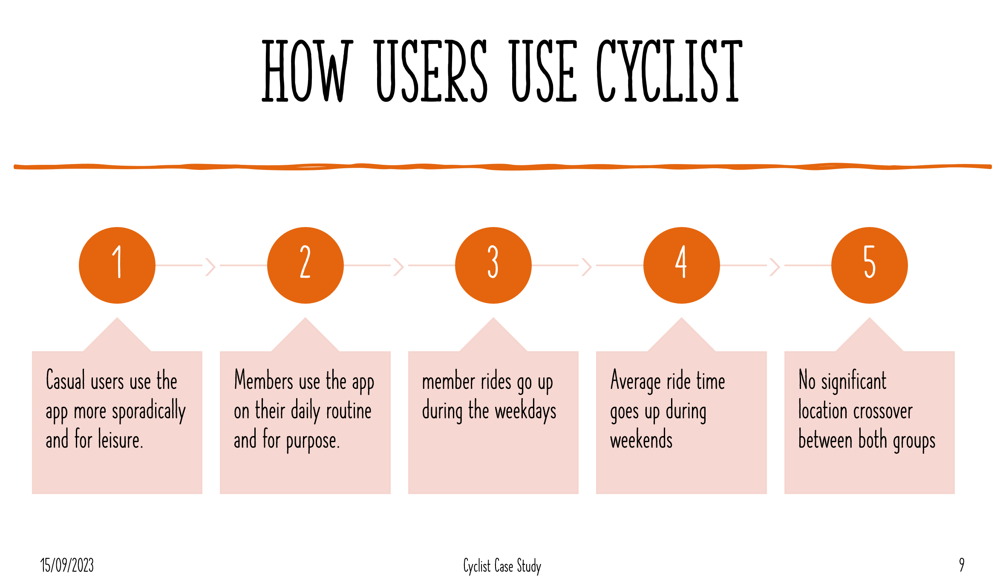

  ---

  ## Conclutions 

  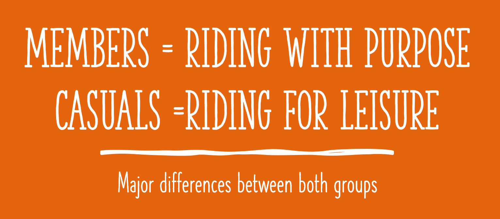

Both groups use the rides for very different purposes. The members make it part of their daily routine and use it for specific purposes. While casual riders use it more for leisure activities and is not necessarily part of their daily activities. With that in mind, an effective marketing campaign would require to target those who are looking to make a switch and use cycling as more constant form of transportation. Also, there may be riders who already use the app more purposefully but have hold off on making the switch to a yearly plan for different reasons. Those users need to be targeted as well. 

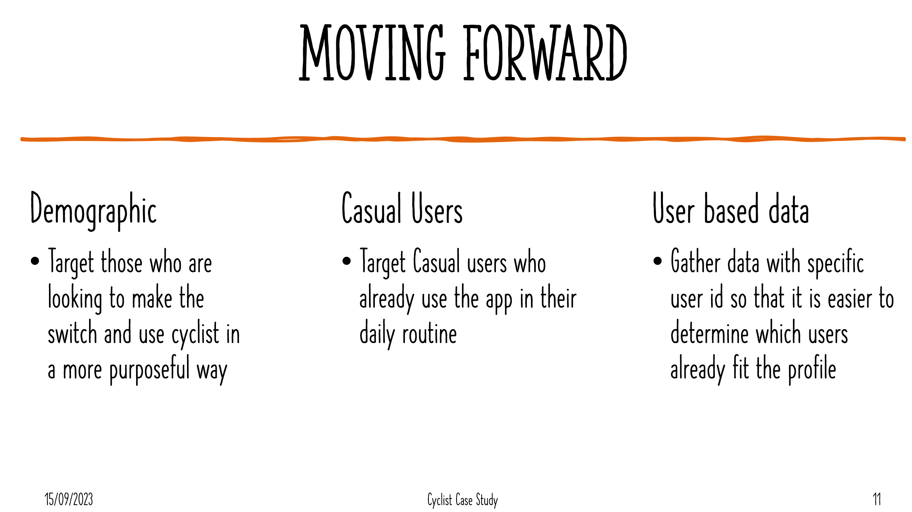

The next step would entail to gather up data on specific user ID´s to determine if there are any riders among the casual group that already fit the description we just stablished and employ ads specifically design so that they make the switch. Specific user ID data would be great so that we can analyze particular behavior and segment appropriately. 

  
  

  

 

